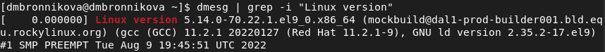
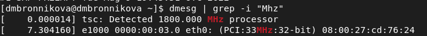
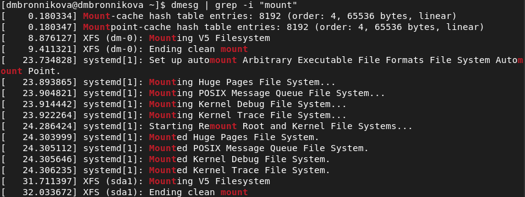

# **Презентация по лабораторной работе №1**

**Установка и конфигурация операционной системы на виртуальную машину**
&nbsp;
&nbsp;

Студентка: Бронникова Де Менезеш Эвелина

Группа: НФИбд-01-19

---

# Цель 

&nbsp;
Целью данной работы является приобретение практических навыков установки операционной системы на виртуальную машину, настройки минимально необходимых для дальнейшей работы сервисов. 

---

# Прагматика выполнения

**VirtualBox**

Программное обеспечение, которое имитирует настоящий компьютер, что дает возможность пользователю устанавливать, запускать и использовать другие операционные системы, как обычные приложения.
&nbsp;
**Rocky Linux**

Корпоративная операционная система с открытым исходным кодом, разработанная для полной совместимости с Red Hat Enterprise Linux. Является альтернативой CentOS.

---

# Задачи
1. Создать виртуальную машины.
2. Использовать поиск с помощью команды `dmesg` для получения следующей информации:
- Версия ядра Linux (Linux version).
- Частота процессора (Detected Mhz processor).
- Модель процессора (CPU0).
- Объем доступной оперативной памяти (Memory available).
- Тип обнаруженного гипервизора (Hypervisor detected).
- Тип файловой системы корневого раздела.
- Последовательность монтирования файловых систем.

---
# Результаты выполнения

1. Создание виртуальной машины

---
2. Поиск с командой `dmesg`

---
dmesg | less

---

dmesg | grep -i "то, что ищем"

---

---
# Выводы

В ходе выполнения данной лабораторной работы приобрелись практические навыки установки операционной системы на виртуальную машину и были выполнены все задания.